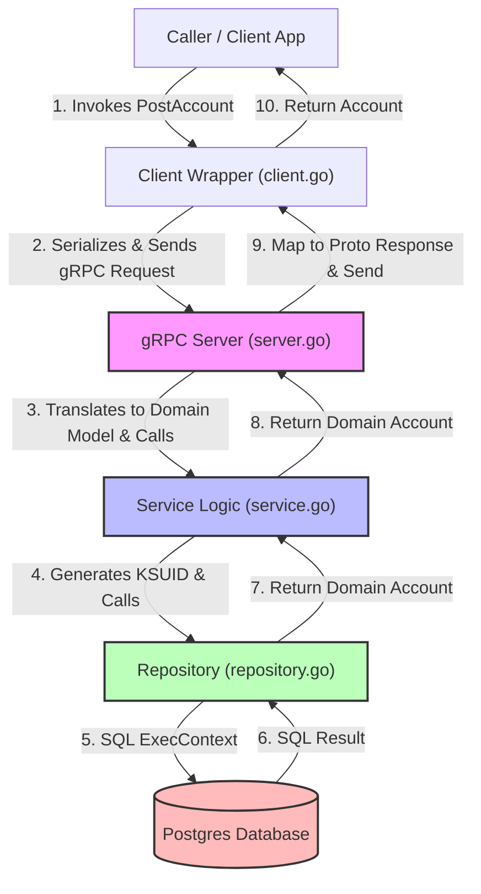

# Account Microservice Architecture Documentation

This document explains the architecture of the **Account Microservice**, the purpose of each file, and how request and response flows travel through the layers of the system.

---

## 📂 File Structure & Usage

The `account` package implements a clean, layered architecture separating network protocols, business logic, and database access.

| File | Purpose | Layer | Key Responsibilities |
| :--- | :--- | :--- | :--- |
| [account.proto](file:///Users/tanikesh/Documents/ecom-micro/account/account.proto) | gRPC Contract | **Interface Definition** | Defines the API endpoints (`PostAccount`, `GetAccount`, `GetAccounts`), request/response messages, and the gRPC service definition. |
| [pb/](file:///Users/tanikesh/Documents/ecom-micro/account/pb) | Generated Code | **Protocol Buffers** | Auto-generated Go files containing struct representations of proto messages and client/server gRPC boilerplates. |
| [client.go](file:///Users/tanikesh/Documents/ecom-micro/account/client.go) | gRPC Client Wrapper | **Client/External** | Wraps the gRPC client connection and exposes convenient Go methods for external services to interact with this microservice. |
| [server.go](file:///Users/tanikesh/Documents/ecom-micro/account/server.go) | gRPC Server | **Transport Layer** | Sets up the TCP listener, initializes the gRPC server, registers the implementation, and handles request conversion between proto models and domain models. |
| [service.go](file:///Users/tanikesh/Documents/ecom-micro/account/service.go) | Domain Logic | **Service Layer** | Implements the core business logic (e.g., ID generation using `ksuid`, validating data constraints). It is independent of transport (gRPC) and database technology (SQL). |
| [repository.go](file:///Users/tanikesh/Documents/ecom-micro/account/repository.go) | Data Access | **Repository Layer** | Handles direct database connection and raw SQL queries (PostgreSQL). Implements the `Repository` interface. |

---

## 🛠 Architectural Layers

The service follows the **Dependency Inversion Principle**. Each layer defines its dependencies using Go interfaces, making the business logic easily testable and decoupled:

```
[ gRPC Client ]   ===>   [ gRPC Server (server.go) ]
                                 │
                                 ▼
                     [ Service Interface (service.go) ]
                                 │
                                 ▼
                    [ Repository Interface (repository.go) ]
                                 │
                                 ▼
                            [ Postgres ]
```

---

## 🔄 Request Flow Diagram

Below is the conceptual flow of a request (e.g., creating an account) as it travels from an external consumer to the database and back.



---

## ⏱ Sequence Diagram: Request Lifecycle

This sequence diagram details how method invocations, parameter mappings, and network protocols interact during a request to create a new account.

```mermaid
sequenceDiagram
    autonumber
    actor Consumer as External Consumer
    participant Client as Client Wrapper (client.go)
    participant protoClient as generated.AccountServiceClient
    participant Net as gRPC Network Channel
    participant Server as gRPC Server (server.go)
    participant Service as Domain Service (service.go)
    participant Repo as DB Repository (repository.go)
    database Postgres as PostgreSQL

    %% Step 1: Client Invocation
    Consumer->>Client: PostAccount(ctx, "John Doe")
    
    %% Step 2: Client mapping to Proto message
    rect rgb(240, 248, 255)
        Note over Client, protoClient: Maps domain input to protobuf Request
        Client->>protoClient: PostAccount(ctx, &pb.PostAccountRequest{Name: "John Doe"})
    end
    
    %% Step 3: Network Transport
    protoClient->>Net: Serialize & Stream over HTTP/2
    Net->>Server: Receive & Deserialize Request

    %% Step 4: Server Handling
    rect rgb(255, 240, 245)
        Note over Server, Service: Extracts data & calls business layer
        Server->>Service: PostAccount(ctx, req.Name)
    end

    %% Step 5: Business Logic Execution
    rect rgb(245, 255, 250)
        Note over Service: Generates unique ID (KSUID)<br/>Creates Account domain entity
        Service->>Repo: PutAccount(ctx, Account{ID: "2D...", Name: "John Doe"})
    end

    %% Step 6: Database Persistence
    Repo->>Postgres: INSERT INTO accounts(id, name) VALUES ($1, $2)
    Postgres-->>Repo: SQL Success
    Repo-->>Service: nil (error status)
    Service-->>Server: &Account{ID: "2D...", Name: "John Doe"}, nil

    %% Step 7: Response Mapping
    rect rgb(255, 240, 245)
        Note over Server: Maps domain Account to pb.Account
    end
    Server-->>Net: &pb.PostAccountResponse{Account: ...}, nil
    Net-->>protoClient: Deserialize Response
    protoClient-->>Client: *pb.PostAccountResponse, nil

    %% Step 8: Return back to domain types
    rect rgb(240, 248, 255)
        Note over Client: Maps pb.Account back to domain Account
    end
    Client-->>Consumer: *Account{ID: "2D...", Name: "John Doe"}, nil
```

---

## 🔍 Detailed Component Analysis

### 1. The Protocol Contract: `account.proto`
Defines the structure of the messages exchanged over the wire and the procedures available:
* Structs are serialized into binary format (protobuf) for high-performance network transfer.
* Generates Go files containing struct formats that implement the gRPC client and server endpoints.

### 2. The gRPC Client Wrapper: `client.go`
This is used by other services (like the API Gateway or Frontend controller) to communicate with this microservice in Go-native code:
* Hides the gRPC serialization boilerplate.
* Acts as an anti-corruption layer by translating the generated protobuf structs (e.g. `*pb.Account`) back into clean domain-level structs (e.g. `*Account`).

### 3. The Transport Layer / gRPC Server: `server.go`
Implements the generated `pb.AccountServiceServer` interface:
* Listens on a configured TCP port.
* Receives incoming gRPC requests, validates them, and invokes the business logic service layer.
* Translates domain errors into corresponding gRPC status codes.

### 4. The Business Logic Layer: `service.go`
Contains the core domain models and validation rules:
* Declares the `Service` interface.
* Coordinates operations: generating globally unique identifiers (`ksuid`) for new accounts, applying domain rules (e.g., paging limits of maximum `100` items).
* Fully isolated from database drivers and web transport layers, allowing easy unit testing with mocked databases.

### 5. The Data Access Layer: `repository.go`
Translates business operations into database-specific instructions:
* Declares the `Repository` interface.
* Connects to PostgreSQL, executes queries, manages transactions, and scans database records into domain models.


protoc --go_out=. --go_opt=module=github.com/sharamatanikesh/ecom-microservice \
       --go-grpc_out=. --go-grpc_opt=module=github.com/sharamatanikesh/ecom-microservice,require_unimplemented_servers=false \
       account/account.proto
